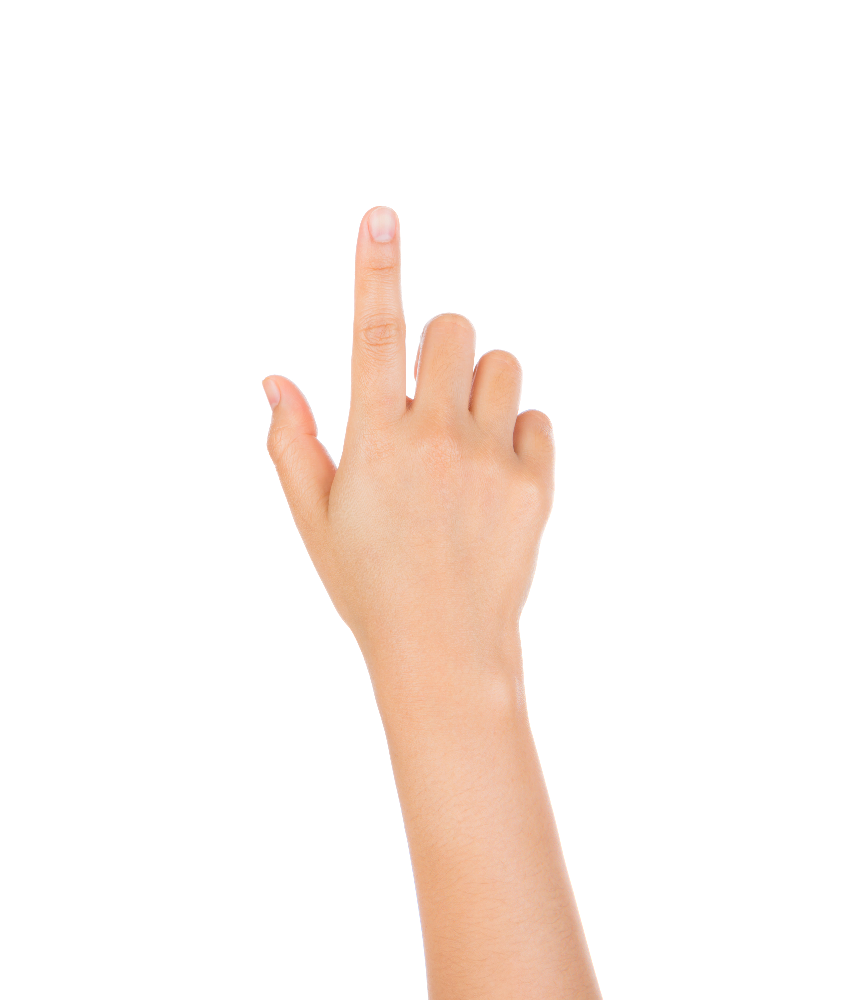
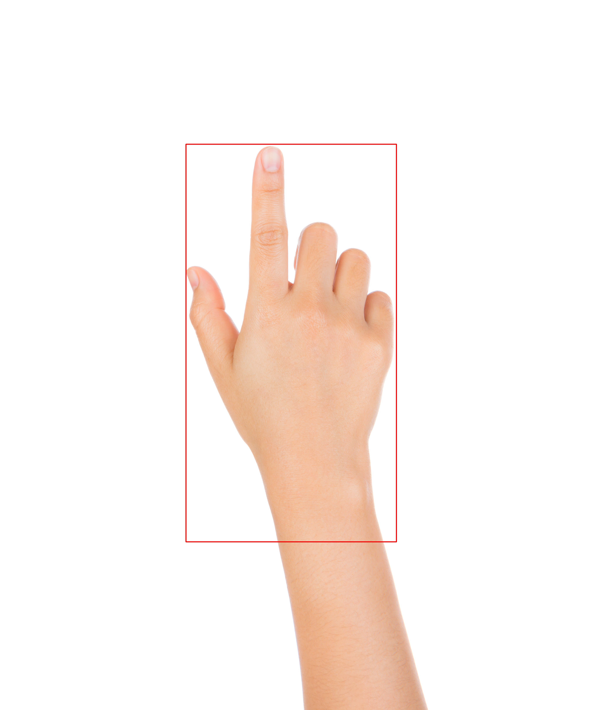

# TTFNetで高速に手の位置を検出

### 論文
https://arxiv.org/abs/1909.00700

### 著者実装
https://github.com/ZJULearning/ttfnet


## インストール
[INSTALL.md](INSTALL.md)を参考にしてmmdetectionをインストールしてください。


## 学習
学習済みモデルだけ使いたい人はスルーで

### データセットの用意
ここでは[EgoHands](http://vision.soic.indiana.edu/projects/egohands/)のデータを使用して学習を行います。

`./data/EgoHands/`に訓練データをダウンロード
```
wget http://vision.soic.indiana.edu/egohands_files/egohands_data.zip
unzip egohands_data.zip -d ./data/EgoHands/
rm egohands_data.zip
```

### アノテーションの用意
TTFNetはmmdetectionというツールを使用して実装されています。
COCOとPASCAL VOCデータセットがデフォルトで使用できるようですが、
それ以外のデータセット(EgoHandsなど)を使うときには、
アノテーションのフォーマットを整える必要があります。
[GETTING_STARTED.md](GETTING_STARTED.md)などを参考にしてください。
EgoHandsについては既に[annotate_egohands.py](./src/annotate_egohands.py)で生成したものが`./data/EgoHands/annotations/`にあります。


### 学習
```
python ./tools/train.py ${CONFIG_FILE}
```
*CONFIG_FILE*にはTTFNetのアーキテクチャや学習などに関する設定の諸々が書いてあります。
学習済みモデルのものは`./src/configs/ttfnet.py`にあります。
著者実装の設定ファイルも`./configs/ttfnet/`にいくつかあるので参考にしていじってみると良いと思います。
学習のログやモデルは`./work_dirs/ttfnet/`に保存されます。


## 推論
このコードでは指定した動画(*VIDEO*)に対して推論を行い、
モデルが予測した手の位置(bounding box)を重ねて描画した動画(*RESULT*)を生成します。
```
python ./src/inference.py ${CONFIG_FILE} ${CHECKPOINT_FILE} ${VIDEO} ${RESULT}
```
*CONFIG_FILE*にはTTFNetのアーキテクチャや学習などに関する設定の諸々が書いてあります。
学習済みモデルのものは`./src/configs/ttfnet.py`にあります。
*CHECKPOINT_FILE*は学習で保存されたモデルのファイルです。
学習済みモデルは`./work_dirs/ttfnet_pretrained/latest.pth`にあります。

---

追伸: 
TTFNetと何かを組み合わせて使いたいときは、
以下のような感じで画像を推論させれば良いと思います。
```python
from mmdet.apis import init_detector, inference_detector

model = init_detector(config_file, checkpoint_file, device="cuda:0")
result = inference_detector(model, image)
```

簡単な例([test.py](./src/test.py)):

|元画像|推論結果|
|---   |---     |
|||


